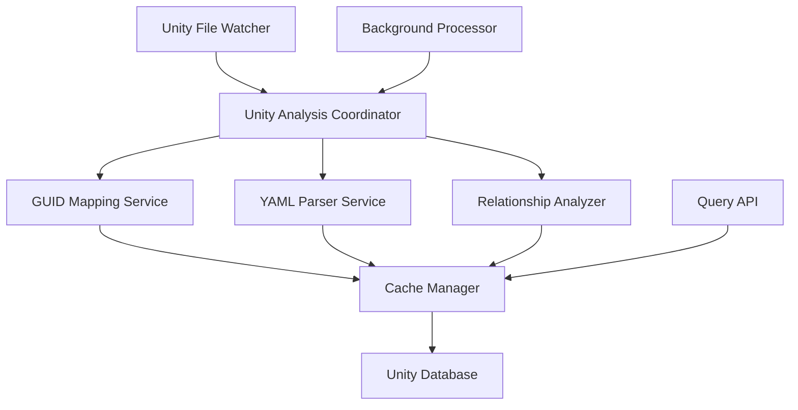
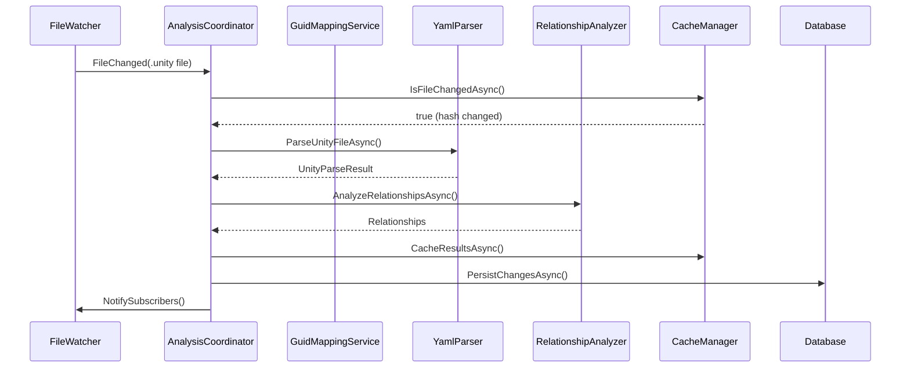

# Issue #27 Optimization Plan: Unity MonoBehaviour-GameObject Relationship Analysis

## Overview

This plan addresses the performance bottlenecks in Unity file analysis by implementing a real-time caching system with file watching capabilities. The solution focuses on optimizing YAML parsing and GUID mapping operations while providing immediate updates when Unity files change.

## Current Architecture Analysis

### Performance Bottlenecks Identified

1. **YAML Parsing Overhead**: Each request requires parsing entire Unity scene/prefab files
2. **GUID Mapping Reconstruction**: .meta file analysis is repeated for every request
3. **No Incremental Processing**: All files are processed regardless of changes
4. **Memory Inefficiency**: No caching of parsed results
5. **Blocking Operations**: Synchronous file processing blocks requests

### Existing Infrastructure

- **SolutionLoaderService**: Already handles .sln file watching
- **RoslynParsingService**: Handles C# file parsing efficiently
- **Database Layer**: Entity Framework with SQLite
- **UnityEvent Entity**: Basic Unity event tracking exists

## Proposed Architecture

### Core Components



### 1. Database Schema Design

#### New Entities

```csharp
// Unity GameObject cache
public class UnityGameObject
{
    public string Id { get; set; }
    public long FileId { get; set; }
    public string Name { get; set; }
    public string ScenePath { get; set; }
    public string Type { get; set; } // "scene" or "prefab"
    public string ContentHash { get; set; }
    public DateTimeOffset LastModified { get; set; }
    public bool IsDeleted { get; set; }
}

// MonoBehaviour component cache
public class UnityMonoBehaviour
{
    public string Id { get; set; }
    public string ScriptGuid { get; set; }
    public string ComponentTypeName { get; set; }
    public long GameObjectFileId { get; set; }
    public string ScenePath { get; set; }
    public string ContentHash { get; set; }
    public DateTimeOffset LastModified { get; set; }
    public bool IsDeleted { get; set; }
}

// GUID to script mapping cache
public class UnityScriptMapping
{
    public string Id { get; set; }
    public string Guid { get; set; }
    public string ScriptPath { get; set; }
    public string FullTypeName { get; set; }
    public string ContentHash { get; set; }
    public DateTimeOffset LastModified { get; set; }
    public bool IsDeleted { get; set; }
}

// File change tracking
public class UnityFileTracking
{
    public string Id { get; set; }
    public string FilePath { get; set; }
    public string ContentHash { get; set; }
    public DateTimeOffset LastAnalyzed { get; set; }
    public DateTimeOffset LastModified { get; set; }
    public UnityFileType FileType { get; set; }
    public bool IsDeleted { get; set; }
}

public enum UnityFileType
{
    Scene,
    Prefab,
    ScriptMeta,
    Other
}
```

#### Database Indices

```sql
-- Performance indices
CREATE INDEX IX_UnityGameObjects_FileId ON UnityGameObjects(FileId);
CREATE INDEX IX_UnityGameObjects_ScenePath ON UnityGameObjects(ScenePath);
CREATE INDEX IX_UnityMonoBehaviour_ScriptGuid ON UnityMonoBehaviours(ScriptGuid);
CREATE INDEX IX_UnityMonoBehaviour_GameObjectFileId ON UnityMonoBehaviours(GameObjectFileId);
CREATE INDEX IX_UnityScriptMapping_Guid ON UnityScriptMappings(Guid);
CREATE INDEX IX_UnityFileTracking_FilePath ON UnityFileTrackings(FilePath);
CREATE INDEX IX_UnityFileTracking_LastModified ON UnityFileTrackings(LastModified);
```

### 2. Service Architecture

#### UnityFileWatcherService
```csharp
public interface IUnityFileWatcherService
{
    Task StartWatchingAsync(string unityProjectPath);
    Task StopWatchingAsync();
    event EventHandler<UnityFileChangedEventArgs> FileChanged;
}

public class UnityFileChangedEventArgs : EventArgs
{
    public string FilePath { get; set; }
    public UnityFileType FileType { get; set; }
    public FileChangeType ChangeType { get; set; }
}
```

#### IUnityGuidMappingService
```csharp
public interface IUnityGuidMappingService
{
    Task<Dictionary<string, string>> GetGuidToScriptMapAsync();
    Task UpdateGuidMappingAsync(string scriptPath);
    Task<string> GetScriptTypeByGuidAsync(string guid);
    Task InvalidateScriptAsync(string scriptPath);
}
```

#### IUnityYamlParserService
```csharp
public interface IUnityYamlParserService
{
    Task<UnityParseResult> ParseUnityFileAsync(string filePath);
    Task<List<UnityGameObject>> ExtractGameObjectsAsync(string filePath);
    Task<List<UnityMonoBehaviour>> ExtractMonoBehavioursAsync(string filePath);
    Task<bool> IsFileModifiedAsync(string filePath);
}
```

#### IUnityRelationshipAnalyzer
```csharp
public interface IUnityRelationshipAnalyzer
{
    Task<List<MonoBehaviourGameObjectRelationship>> AnalyzeRelationshipsAsync(string filePath);
    Task<List<MonoBehaviourGameObjectRelationship>> GetRelationshipsByComponentTypeAsync(string componentType);
    Task<List<MonoBehaviourGameObjectRelationship>> GetRelationshipsByGameObjectAsync(string gameObjectName);
}
```

#### IUnityCacheManager
```csharp
public interface IUnityCacheManager
{
    Task<T> GetAsync<T>(string key) where T : class;
    Task SetAsync<T>(string key, T value, TimeSpan? expiry = null);
    Task InvalidateAsync(string pattern);
    Task<bool> IsFileChangedAsync(string filePath, string contentHash);
    Task UpdateFileTrackingAsync(string filePath, string contentHash);
}
```

### 3. Real-time Processing Pipeline

#### File Change Processing Flow



#### Incremental Analysis Strategy

1. **File Hash Comparison**: Compare file hashes to detect changes
2. **Selective Processing**: Only process modified files
3. **Dependency Tracking**: Track file dependencies for cascade updates
4. **Batch Processing**: Group multiple changes for efficiency

### 4. Background Processing

#### UnityBackgroundAnalysisService
```csharp
public class UnityBackgroundAnalysisService : BackgroundService
{
    protected override async Task ExecuteAsync(CancellationToken stoppingToken)
    {
        while (!stoppingToken.IsCancellationRequested)
        {
            // Process queued file changes
            await ProcessQueuedChangesAsync();
            
            // Perform periodic full sync (if needed)
            await PerformPeriodicSyncAsync();
            
            await Task.Delay(TimeSpan.FromSeconds(1), stoppingToken);
        }
    }
}
```

### 5. Query API Design

#### Relationship Queries
```csharp
// Get all GameObjects for a MonoBehaviour type
public async Task<List<GameObjectReference>> GetGameObjectsByComponentTypeAsync(string componentTypeName);

// Get all MonoBehaviour components for a GameObject
public async Task<List<MonoBehaviourReference>> GetComponentsByGameObjectNameAsync(string gameObjectName);

// Get relationships by scene
public async Task<List<RelationshipDto>> GetRelationshipsBySceneAsync(string scenePath);

// Get all relationships for a Unity project
public async Task<UnityRelationshipSummary> GetProjectRelationshipsAsync();
```

#### Response Models
```csharp
public class MonoBehaviourGameObjectRelationship
{
    public string ComponentTypeName { get; set; }
    public string GameObjectName { get; set; }
    public string ScenePath { get; set; }
    public string SceneType { get; set; } // "scene" or "prefab"
    public string ScriptGuid { get; set; }
    public string ScriptPath { get; set; }
}

public class UnityRelationshipSummary
{
    public int TotalGameObjects { get; set; }
    public int TotalMonoBehaviours { get; set; }
    public int TotalRelationships { get; set; }
    public int SceneCount { get; set; }
    public int PrefabCount { get; set; }
    public Dictionary<string, int> ComponentTypeDistribution { get; set; }
}
```

### 6. Performance Optimizations

#### Caching Strategy
- **Multi-level Caching**: Memory cache + database cache
- **Lazy Loading**: Load data on-demand with pre-fetching
- **Cache Warming**: Pre-load frequently accessed data
- **Cache Invalidation**: Smart invalidation based on dependencies

#### Parallel Processing
- **File-level Parallelism**: Process multiple files simultaneously
- **Pipeline Parallelism**: Overlap parsing and analysis stages
- **Async Operations**: Non-blocking I/O throughout

#### Memory Management
- **Streaming Parsing**: Process large files in chunks
- **Object Pooling**: Reuse parser objects
- **Memory Monitoring**: Track and optimize memory usage

### 7. Configuration

#### UnityAnalysisSettings
```csharp
public class UnityAnalysisSettings
{
    public string UnityProjectPath { get; set; }
    public bool EnableFileWatching { get; set; } = true;
    public bool EnableBackgroundProcessing { get; set; } = true;
    public int MaxConcurrentFiles { get; set; } = 4;
    public TimeSpan CacheExpiry { get; set; } = TimeSpan.FromHours(1);
    public TimeSpan FullSyncInterval { get; set; } = TimeSpan.FromMinutes(30);
    public string[] WatchedFileExtensions { get; set; } = { ".unity", ".prefab", ".cs.meta" };
}
```

### 8. Monitoring and Diagnostics

#### Metrics to Track
- File processing time
- Cache hit/miss ratios
- Memory usage
- Queue depth for background processing
- Error rates and types

#### Health Checks
- File watcher status
- Database connectivity
- Cache service health
- Background service status

## Implementation Phases

### Phase 1: Core Infrastructure (Week 1-2)
1. Database schema and migrations
2. Basic service interfaces
3. File hashing and change detection
4. Simple YAML parsing implementation

### Phase 2: Real-time Processing (Week 3-4)
1. File watcher service implementation
2. Background processing service
3. Cache manager implementation
4. Incremental analysis pipeline

### Phase 3: Advanced Features (Week 5-6)
1. VYaml integration for performance
2. Parallel processing optimization
3. Advanced caching strategies
4. Query API implementation

### Phase 4: Testing and Optimization (Week 7-8)
1. comprehensive testing suite
2. Performance optimization
3. Monitoring and diagnostics
4. Documentation and deployment

## Expected Performance Improvements

- **First Request**: Similar performance (cold cache)
- **Subsequent Requests**: 10-100x faster (warm cache)
- **File Change Response**: Near real-time updates
- **Memory Usage**: Reduced through efficient caching
- **Scalability**: Better handling of large Unity projects

## Risks and Mitigations

### Technical Risks
- **YAML Parsing Complexity**: Mitigate with VYaml library and fallback options
- **File System Limitations**: Handle large projects with efficient file watching
- **Memory Pressure**: Implement memory limits and cleanup strategies

### Operational Risks
- **Cache Invalidation**: Ensure consistency with proper dependency tracking
- **Background Processing**: Prevent resource exhaustion with throttling
- **Database Performance**: Optimize queries and add proper indexing

## Success Criteria

1. **Performance**: < 100ms response time for cached queries
2. **Real-time Updates**: < 1 second delay from file change to cache update
3. **Reliability**: 99.9% uptime with proper error handling
4. **Scalability**: Handle Unity projects with 10,000+ files
5. **Memory Efficiency**: < 500MB memory usage for large projects