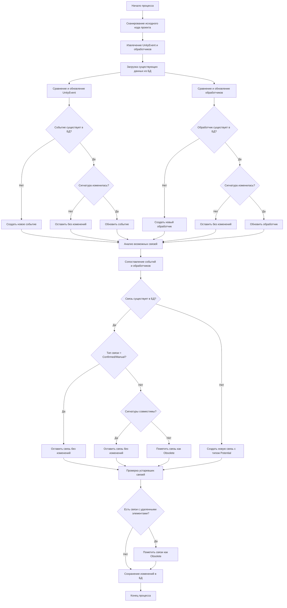

см. https://github.com/Prikalel/OLLAMACHAT/issues/29

# Блок-схема процесса парсинга и анализа Unity исходного кода



## Детальное описание процесса

### 1. Фаза сканирования и извлечения
- **Сканирование исходного кода**: Рекурсивный обзор всех C# файлов в проекте
- **Извлечение UnityEvent**: Поиск полей типа `UnityEvent`, `UnityEvent<T>`
- **Извлечение обработчиков**: Поиск методов с подходящей сигнатурой (void возвращаемый тип)

### 2. Фаза сравнения и обновления

#### Для UnityEvent:
```csharp
foreach (var scannedEvent in scannedEvents)
{
    var existingEvent = db.UnityEvents
        .FirstOrDefault(e => e.FullName == scannedEvent.FullName &&
                            e.FilePath == scannedEvent.FilePath);

    if (existingEvent == null)
    {
        // Новое событие
        db.UnityEvents.Add(scannedEvent);
    }
    else if (existingEvent.ArgumentsHash != scannedEvent.ArgumentsHash)
    {
        // Обновление существующего события
        existingEvent.EventType = scannedEvent.EventType;
        existingEvent.GenericTypeArguments = scannedEvent.GenericTypeArguments;
        existingEvent.ArgumentsHash = scannedEvent.ArgumentsHash;
        existingEvent.UpdateLastModified();
    }
    // Если событие существует и не изменилось - оставляем как есть
}
```

#### Для обработчиков (аналогично):
- Создание новых обработчиков
- Обновление изменившихся обработчиков
- Сохранение неизмененных обработчиков

### 3. Фаза анализа связей

```csharp
foreach (var possibleRelationship in potentialRelationships)
{
    var existingRelationship = db.EventHandlerRelationships
        .FirstOrDefault(r => r.EventId == possibleRelationship.EventId &&
                           r.HandlerId == possibleRelationship.HandlerId &&
                           !r.IsDeleted);

    if (existingRelationship == null)
    {
        // Новая связь
        var newRelationship = new EventHandlerRelationship
        {
            EventHandlerRelationshipType = EventHandlerRelationshipType.Potential,
            Source = Source.Parser
        };
        db.EventHandlerRelationships.Add(newRelationship);
    }
    else if (existingRelationship.Source == Source.Manual ||
             existingRelationship.EventHandlerRelationshipType == EventHandlerRelationshipType.Confirmed)
    {
        // Сохраняем пользовательские и подтвержденные связи
        continue;
    }
    else if (!AreSignaturesCompatible(existingRelationship.Event, existingRelationship.Handler))
    {
        // Критическое изменение - разрыв связи
        existingRelationship.MarkAsDeleted(DeletionReason.SignatureChanged);
    }
}
```

### 4. Фаза очистки устаревших данных

```csharp
// Помечаем связи с удаленными событиями/обработчиками
var obsoleteRelationships = db.EventHandlerRelationships
    .Where(r => !r.IsDeleted &&
               (r.Event.IsDeleted || r.Handler.IsDeleted));

foreach (var relationship in obsoleteRelationships)
{
    var reason = r.Event.IsDeleted ? DeletionReason.EventDeleted : DeletionReason.HandlerDeleted;
    relationship.MarkAsDeleted(reason);
}
```

## Ключевые принципы

1. **Приоритет пользовательских данных**: Связи с `Source.Manual` и `RelationshipType.Confirmed` никогда не перезаписываются автоматически
2. **Мягкое удаление**: Все удаления помечаются флагом, а не удаляются физически
3. **Отслеживание изменений**: Хэши аргументов позволяют быстро определить изменения сигнатур
4. **Итеративность**: Процесс можно запускать многократно без потери пользовательских пометок
5. **Атомарность**: Все изменения выполняются в транзакции для сохранения целостности данных

Этот процесс гарантирует, что пользовательские настройки связей сохраняются, при этом автоматически обнаруживаются новые потенциальные связи и обрабатываются критические изменения в коде.