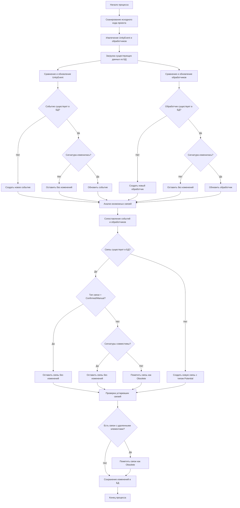

см. https://github.com/Prikalel/OLLAMACHAT/issues/29

# Блок-схема процесса парсинга и анализа Unity исходного кода



## Детальное описание процесса

### 1. Фаза сканирования и извлечения
- **Сканирование исходного кода**: Рекурсивный обзор всех C# файлов в проекте
- **Извлечение UnityEvent**: Поиск полей типа `UnityEvent`, `UnityEvent<T>`
- **Извлечение обработчиков**: Поиск методов с подходящей сигнатурой (void возвращаемый тип)

### 2. Фаза сравнения и обновления

#### Для UnityEvent:
```csharp
foreach (var scannedEvent in scannedEvents)
{
    var existingEvent = db.UnityEvents
        .FirstOrDefault(e => e.FullName == scannedEvent.FullName &&
                            e.FilePath == scannedEvent.FilePath);

    if (existingEvent == null)
    {
        // Новое событие
        db.UnityEvents.Add(scannedEvent);
    }
    else if (existingEvent.ArgumentsHash != scannedEvent.ArgumentsHash)
    {
        // Обновление существующего события
        existingEvent.EventType = scannedEvent.EventType;
        existingEvent.GenericTypeArguments = scannedEvent.GenericTypeArguments;
        existingEvent.ArgumentsHash = scannedEvent.ArgumentsHash;
        existingEvent.UpdateLastModified();
    }
    // Если событие существует и не изменилось - оставляем как есть
}
```

#### Для обработчиков (аналогично):
- Создание новых обработчиков
- Обновление изменившихся обработчиков
- Сохранение неизмененных обработчиков

### 3. Фаза анализа связей

```csharp
foreach (var possibleRelationship in potentialRelationships)
{
    var existingRelationship = db.EventHandlerRelationships
        .FirstOrDefault(r => r.EventId == possibleRelationship.EventId &&
                           r.HandlerId == possibleRelationship.HandlerId &&
                           !r.IsDeleted);

    if (existingRelationship == null)
    {
        // Новая связь
        var newRelationship = new EventHandlerRelationship
        {
            EventHandlerRelationshipType = EventHandlerRelationshipType.Potential,
            Source = Source.Parser
        };
        db.EventHandlerRelationships.Add(newRelationship);
    }
    else if (existingRelationship.Source == Source.Manual ||
             existingRelationship.EventHandlerRelationshipType == EventHandlerRelationshipType.Confirmed)
    {
        // Сохраняем пользовательские и подтвержденные связи
        continue;
    }
    else if (!AreSignaturesCompatible(existingRelationship.Event, existingRelationship.Handler))
    {
        // Критическое изменение - разрыв связи
        existingRelationship.MarkAsDeleted(DeletionReason.SignatureChanged);
    }
}
```

### 4. Фаза очистки устаревших данных

```csharp
// Помечаем связи с удаленными событиями/обработчиками
var obsoleteRelationships = db.EventHandlerRelationships
    .Where(r => !r.IsDeleted &&
               (r.Event.IsDeleted || r.Handler.IsDeleted));

foreach (var relationship in obsoleteRelationships)
{
    var reason = r.Event.IsDeleted ? DeletionReason.EventDeleted : DeletionReason.HandlerDeleted;
    relationship.MarkAsDeleted(reason);
}
```

## Ключевые принципы

1. **Приоритет пользовательских данных**: Связи с `Source.Manual` и `RelationshipType.Confirmed` никогда не перезаписываются автоматически
2. **Мягкое удаление**: Все удаления помечаются флагом, а не удаляются физически
3. **Отслеживание изменений**: Хэши аргументов позволяют быстро определить изменения сигнатур
4. **Итеративность**: Процесс можно запускать многократно без потери пользовательских пометок

Этот процесс гарантирует, что пользовательские настройки связей сохраняются, при этом автоматически обнаруживаются новые потенциальные связи и обрабатываются критические изменения в коде.

---

## Критические проблемы в текущей реализации:

### 1. **Отсутствие загрузки существующих данных**
```csharp
// ПРОБЛЕМА: Код не загружает существующие данные из БД перед анализом
// РЕШЕНИЕ: Нужно загрузить существующие события, обработчики и связи
var existingEvents = await eventRepository.GetAllAsync();
var existingHandlers = await handlerRepository.GetAllAsync();
var existingRelationships = await relationshipRepository.GetAllAsync();
```

### 2. **Перезапись пользовательских связей**
```csharp
// ПРОБЛЕМА: В UpdateOrCreateEventHandlerRelationship всегда обновляется Source
if (existingRelationship.Source == Source.Manual)
{
    existingRelationship.Source = Source.Manual; // Бесполезная операция
}
else
{
    existingRelationship.Source = source; // ПЕРЕЗАПИСЬ!
}

// РЕШЕНИЕ: Не трогать Source для Manual связей
if (existingRelationship.Source != Source.Manual)
{
    existingRelationship.Source = source;
}
```

### 3. **Отсутствие обработки удаленных элементов**
```csharp
// ПРОБЛЕМА: Нет проверки на удаленные события/обработчики
// РЕШЕНИЕ: Добавить проверку и пометку устаревших связей
var deletedEvents = existingEvents.Where(e => 
    !scannedEvents.Any(se => se.FullName == e.FullName));
    
foreach (var deletedEvent in deletedEvents)
{
    deletedEvent.MarkAsDeleted();
    // Пометить связанные связи как Obsolete
}
```

### 4. **Неправильная логика совместимости аргументов**
```csharp
// ПРОБЛЕМА: Сравнение только по хэшу, без учета типа события
private bool AreArgumentsCompatible(UnityEvent unityEvent, Data.Parser.EventHandler eventHandler)
{
    return unityEvent.ArgumentsHash == eventHandler.ArgumentsHash; // НЕДОСТАТОЧНО!
}

// РЕШЕНИЕ: Сложная логика совместимости
private bool AreArgumentsCompatible(UnityEvent unityEvent, EventHandler eventHandler)
{
    // Для UnityEvent (без generic) - обработчик без параметров
    if (unityEvent.EventType == "UnityEvent" && eventHandler.ParameterTypes.Length == 0)
        return true;
        
    // Для UnityEvent<T> - проверка типов параметров
    if (unityEvent.GenericTypeArguments != null && 
        unityEvent.GenericTypeArguments.Length == eventHandler.ParameterTypes.Length)
    {
        return unityEvent.GenericTypeArguments.SequenceEqual(eventHandler.ParameterTypes);
    }
    
    return false;
}
```

### 5. **Отсутствие обработки критических изменений**
```csharp
// ПРОБЛЕМА: Нет логики для разрыва связей при изменении сигнатур
// РЕШЕНИЕ: Добавить проверку изменений сигнатур
foreach (var relationship in existingRelationships)
{
    var event = scannedEvents.FirstOrDefault(e => e.Id == relationship.EventId);
    var handler = scannedHandlers.FirstOrDefault(h => h.Id == relationship.HandlerId);
    
    if (event == null || handler == null || !AreArgumentsCompatible(event, handler))
    {
        relationship.MarkAsDeleted(DeletionReason.SignatureChanged);
    }
}
```

### 6. **Неправильная работа с наследованием**
```csharp
// ПРОБЛЕМА: ProcessInheritedEventHandlersAsync только логирует, но не создает сущности
// РЕШЕНИЕ: Реализовать настоящий анализ наследования
private async Task ProcessInheritedEventHandlersAsync(
    ParsedEntity classEntity, string filePath, 
    List<EventHandler> eventHandlers, CancellationToken cancellationToken)
{
    foreach (var baseClassFullName in classEntity.Inheritance.AllBaseClasses)
    {
        // Найти методы базового класса в БД или проанализировать их
        var baseClassHandlers = await FindHandlersInBaseClass(baseClassFullName);
        eventHandlers.AddRange(baseClassHandlers);
    }
}
```

## Конкретные исправления:

### 1. **Переписать `PopulateUnityEventData.Handle` метод:**

```csharp
public async ValueTask<Response> Handle(Command request, CancellationToken cancellationToken)
{
    // 1. Загрузить существующие данные из БД
    var existingEvents = await eventRepository.GetAllAsync();
    var existingHandlers = await handlerRepository.GetAllAsync();
    var existingRelationships = await relationshipRepository.GetAllAsync();

    // 2. Сканировать проект и получить новые данные
    var (scannedEvents, scannedHandlers) = await ScanProjectAsync();

    // 3. Сравнить и обновить события
    await UpdateEventsAsync(existingEvents, scannedEvents);
    
    // 4. Сравнить и обновить обработчики  
    await UpdateHandlersAsync(existingHandlers, scannedHandlers);
    
    // 5. Обновить связи с учетом изменений
    var updatedRelationships = await UpdateRelationshipsAsync(
        existingRelationships, existingEvents, existingHandlers);

    // 6. Пометить устаревшие связи
    await MarkObsoleteRelationshipsAsync(existingRelationships, scannedEvents, scannedHandlers);
}
```

### 2. **Исправить `UpdateOrCreateEventHandlerRelationship`:**
```csharp
public async ValueTask<Response> Handle(Command request, CancellationToken cancellationToken)
{
    var existingRelationship = await repository.GetSingle(
        r => r.EventId == eventId && r.HandlerId == handlerId && !r.IsDeleted);

    if (existingRelationship != null)
    {
        // СОХРАНЯЕМ пользовательские данные
        if (existingRelationship.Source == Source.Manual || 
            existingRelationship.EventHandlerRelationshipType == EventHandlerRelationshipType.Confirmed)
        {
            // Не обновляем тип связи для подтвержденных/ручных связей
            logger.LogDebug("Сохранена пользовательская связь");
            return new Response(existingRelationship, false);
        }

        // Только для автоматических связей обновляем данные
        existingRelationship.Source = source;
        existingRelationship.EventHandlerRelationshipType = relationshipType;
        existingRelationship.UpdateLastModified();
        
        await repository.UpdateAsync(existingRelationship);
        return new Response(existingRelationship, false);
    }
    else
    {
        // Создание новой связи...
    }
}
```

### 3. **Добавить команду для сравнения изменений:**
```csharp
public class ChangeDetectionService
{
    public Handler(
        (IEnumerable<UnityEvent> existingEvents, 
        IEnumerable<UnityEvent> scannedEvents) commandBody)
    {
        var result = new ChangeDetectionResult();
        
        // Найти новые события
        result.NewEvents = scannedEvents.ExceptBy(existingEvents.Select(e => e.FullName), s => s.FullName);
        
        // Найти измененные события (по хэшу аргументов)
        result.ChangedEvents = scannedEvents.Join(existingEvents,
            s => s.FullName, e => e.FullName,
            (s, e) => new { Scanned = s, Existing = e })
            .Where(x => x.Scanned.ArgumentsHash != x.Existing.ArgumentsHash);
            
        // Найти удаленные события
        result.DeletedEvents = existingEvents.ExceptBy(scannedEvents.Select(s => s.FullName), e => e.FullName);
        
        return result;
    }
}
```

## Рекомендуемый порядок исправлений:

1. **Сначала** реализовать загрузку существующих данных
2. **Затем** добавить команду сравнения изменений
3. **Потом** исправить логику обновления связей
4. **Далее** добавить обработку критических изменений

Текущая реализация вашего друга нарушает основной принцип итеративности - сохранение пользовательских данных. Нужно полностью переработать подход к сравнению и обновлению, а не просто добавлять новые записи поверх старых.