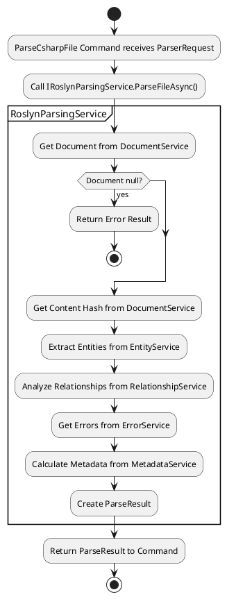
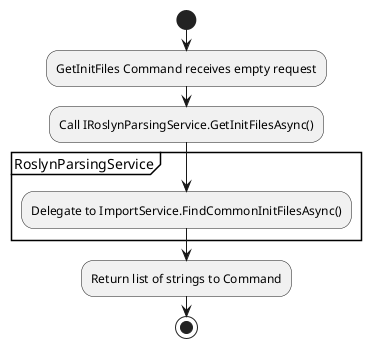
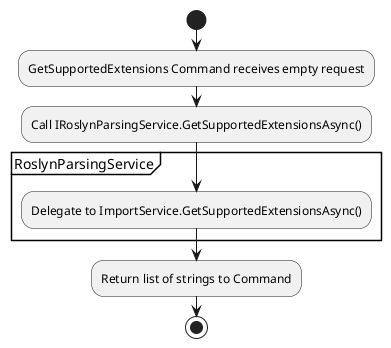
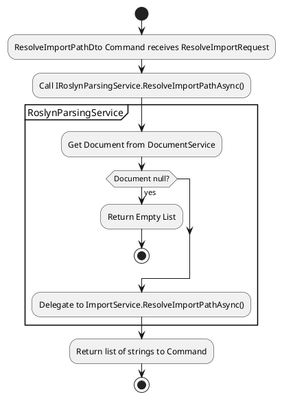

# Roslyn-Based Parsing Architecture Plan for OLLAMACHAT

## Executive Summary

This document outlines a focused architectural plan for implementing Roslyn-based parsing logic in the OLLAMACHAT project. The architecture ensures proper separation of concerns, clean interface design, and robust error handling.

## 1. Service Interfaces

### 1.1 Core Parsing Service (Orchestrator)

```csharp
public interface IRoslynParsingService
{
    Task<ParseResult> ParseFileAsync(string filePath, string repoPath, ParserOptions? options);
    Task<List<string>> GetSupportedExtensionsAsync();
    Task<List<string>> GetInitFilesAsync(string repoPath);
    Task<List<string>> ResolveImportPathAsync(string importPath, string filePath, string repoPath);
}
```

### 1.2 Document Service

```csharp
public interface IDocumentService
{
    Task<Document?> GetDocumentAsync(string filePath, string repoPath);
    Task<SyntaxTree> GetSyntaxTreeAsync(Document document);
    Task<SemanticModel> GetSemanticModelAsync(Document document);
    Task<string> GetContentHashAsync(Document document);
}
```

### 1.3 Entity Service

```csharp
public interface IEntityService
{
    Task<ParsedEntity> ExtractEntityAsync(ISymbol symbol, SemanticModel semanticModel);
    Task<IEnumerable<ParsedEntity>> ExtractEntitiesAsync(Document document);
    Task<List<ParsedEntity>> ExtractChildEntitiesAsync(ISymbol symbol, SemanticModel semanticModel);
}
```

### 1.4 Mapper Service

```csharp
public interface IMapperService
{
    // Entity mapping
    ParsedEntityType MapSymbolKindToEntityType(SymbolKind symbolKind);
    Location MapLocation(Location location);
    IEnumerable<string> MapModifiers(ISymbol symbol);
    ParsedEntityInheritance MapInheritance(INamedTypeSymbol typeSymbol);
    string? MapReturnType(ISymbol symbol);
    List<ModelParameter> MapParameters(IMethodSymbol methodSymbol);
    ParsedEntityImportData MapImportData(ISymbol symbol);
    List<Decorator> MapAttributes(ISymbol symbol);
    
    // Error mapping
    ParseErrorSeverity MapSeverity(DiagnosticSeverity diagnosticSeverity);
    Location MapErrorLocation(Location location);
}
```

### 1.5 Relationship Service

```csharp
public interface IRelationshipService
{
    Task<IEnumerable<Relationship>> AnalyzeRelationshipsAsync(IEnumerable<ParsedEntity> entities, Document document);
}
```

### 1.6 Error Service

```csharp
public interface IErrorService
{
    Task<IEnumerable<ParseError>> GetDiagnosticsAsync(Document document);
}
```

### 1.7 Metadata Service

```csharp
public interface IMetadataService
{
    FileMetadata CalculateFileMetadata(Document document, IEnumerable<ParsedEntity> entities);
}
```

### 1.8 Import Service

```csharp
public interface IImportService
{
    Task<List<string>> ResolveImportPathAsync(string importPath, Document document);
    Task<List<string>> FindCommonInitFilesAsync(string repoPath);
    Task<List<string>> GetSupportedExtensionsAsync();
}
```

## 2. Data Flow Diagram

```plantuml
@startuml
package "Mediator Layer" {
    component [ParseCsharpFile] as ParseCsharpFile
    component [GetInitFiles] as GetInitFiles
    component [GetSupportedExtensions] as GetSupportedExtensions
    component [ResolveImportPathDto] as ResolveImportPathDto
}

package "Service Layer" {
    component [IRoslynParsingService] as RoslynParsingService
    component [IDocumentService] as DocumentService
    component [IEntityService] as EntityService
    component [IMapperService] as MapperService
    component [IRelationshipService] as RelationshipService
    component [IErrorService] as ErrorService
    component [IMetadataService] as MetadataService
    component [IImportService] as ImportService
}

package "External Services" {
    component [ISolutionLoaderService] as SolutionLoaderService
}

package "Roslyn" {
    component [SyntaxTree] as SyntaxTree
    component [SemanticModel] as SemanticModel
    component [ISymbol] as Symbol
    component [Document] as Document
}

package "Models" {
    component [ParseResult] as ParseResult
    component [ParsedEntity] as ParsedEntity
    component [Relationship] as Relationship
    component [ParseError] as ParseError
}

' Relationships
ParseCsharpFile --> RoslynParsingService
GetInitFiles --> RoslynParsingService
GetSupportedExtensions --> RoslynParsingService
ResolveImportPathDto --> RoslynParsingService

RoslynParsingService --> DocumentService
RoslynParsingService --> EntityService
RoslynParsingService --> RelationshipService
RoslynParsingService --> ErrorService
RoslynParsingService --> MetadataService
RoslynParsingService --> ImportService

EntityService --> MapperService
ErrorService --> MapperService

DocumentService --> SolutionLoaderService
DocumentService --> Document
DocumentService --> SyntaxTree
DocumentService --> SemanticModel

EntityService --> Symbol
EntityService --> SemanticModel

RelationshipService --> Document
RelationshipService --> Symbol

ErrorService --> Document

ImportService --> SolutionLoaderService
ImportService --> Document

MetadataService --> Document

RoslynParsingService --> ParseResult
EntityService --> ParsedEntity
RelationshipService --> Relationship
ErrorService --> ParseError

@enduml
```



## 3. Service Dependencies

### 3.1 IRoslynParsingService Dependencies
- `IDocumentService` - To handle document operations
- `IEntityService` - To extract entities
- `IRelationshipService` - To analyze relationships
- `IErrorService` - To handle diagnostics
- `IMetadataService` - To calculate file metadata
- `IImportService` - To handle import-related operations

### 3.2 IDocumentService Dependencies
- `ISolutionLoaderService` - To access solution and document information

### 3.3 IEntityService Dependencies
- `IMapperService` - To map symbols to entities

### 3.4 IRelationshipService Dependencies
- `ISolutionLoaderService` - To access document information

### 3.5 IErrorService Dependencies
- `IMapperService` - To map diagnostics to errors
- `ISolutionLoaderService` - To access document information

### 3.6 IMetadataService Dependencies
- No external dependencies

### 3.7 IImportService Dependencies
- `ISolutionLoaderService` - To access solution and document information

## 4. IRoslynParsingService Implementation Structure

```csharp
public class RoslynParsingService : IRoslynParsingService
{
    private readonly IDocumentService _documentService;
    private readonly IEntityService _entityService;
    private readonly IRelationshipService _relationshipService;
    private readonly IErrorService _errorService;
    private readonly IMetadataService _metadataService;
    private readonly IImportService _importService;

    public RoslynParsingService(
        IDocumentService documentService,
        IEntityService entityService,
        IRelationshipService relationshipService,
        IErrorService errorService,
        IMetadataService metadataService,
        IImportService importService)
    {
        _documentService = documentService;
        _entityService = entityService;
        _relationshipService = relationshipService;
        _errorService = errorService;
        _metadataService = metadataService;
        _importService = importService;
    }

    public async Task<ParseResult> ParseFileAsync(string filePath, string repoPath, ParserOptions? options)
    {
        var stopwatch = Stopwatch.StartNew();
        var effectiveOptions = options;
        
        try
        {
            // Get document
            var document = await _documentService.GetDocumentAsync(filePath, repoPath);
            if (document == null)
            {
                return CreateErrorResult($"Document not found: {filePath}");
            }
            
            // Get content hash for potential future use
            var contentHash = await _documentService.GetContentHashAsync(document);
            
            // Extract entities
            var entities = await _entityService.ExtractEntitiesAsync(document);
            
            // Analyze relationships
            var relationships = await _relationshipService.AnalyzeRelationshipsAsync(entities, document);
            
            // Get diagnostics
            var errors = await _errorService.GetDiagnosticsAsync(document);
            
            // Calculate metadata
            var metadata = _metadataService.CalculateFileMetadata(document, entities);
            
            // Create result
            var result = new ParseResult(
                FilePath: filePath,
                Language: ParseResultLanguage.Csharp,
                Entities: entities.ToList(),
                Relationships: relationships.ToList(),
                ContentHash: contentHash,
                ParseTimeMs: (int)stopwatch.ElapsedMilliseconds,
                Errors: errors.ToList(),
                Metadata: metadata
            );
            
            return result;
        }
        catch (Exception ex)
        {
            return CreateErrorResult($"Parsing failed: {ex.Message}");
        }
    }

    public async Task<List<string>> GetSupportedExtensionsAsync()
    {
        return await _importService.GetSupportedExtensionsAsync();
    }

    public async Task<List<string>> GetInitFilesAsync(string repoPath)
    {
        return await _importService.FindCommonInitFilesAsync(repoPath);
    }

    public async Task<List<string>> ResolveImportPathAsync(string importPath, string filePath, string repoPath)
    {
        var document = await _documentService.GetDocumentAsync(filePath, repoPath);
        if (document == null)
        {
            return new List<string>();
        }
        
        return await _importService.ResolveImportPathAsync(importPath, document);
    }

    private ParseResult CreateErrorResult(string errorMessage)
    {
        return new ParseResult(
            FilePath: "",
            Language: ParseResultLanguage.Csharp,
            Entities: new List<ParsedEntity>(),
            Relationships: new List<Relationship>(),
            ContentHash: "",
            ParseTimeMs: 0,
            Errors: new List<ParseError>
            {
                new ParseError(
                    Message: errorMessage,
                    Severity: ParseErrorSeverity.Error,
                    Location: null
                )
            },
            Metadata: null
        );
    }
}
```

## 5. Data Flow for Existing Mediator Commands

### 5.1 ParseCsharpFile Command Flow



### 5.2 GetInitFiles Command Flow



### 5.3 GetSupportedExtensions Command Flow



### 5.4 ResolveImportPathDto Command Flow



## 6. Implementation Notes

### 6.1 Clean Interface Design
- Each interface has a clear, focused responsibility
- Mapping operations are consolidated into a single mapper service
- Synchronous operations are not marked as async
- No unused interface methods

### 6.2 Proper Error Handling
- Main service includes comprehensive error handling
- Document loading failures are properly handled
- Error results are returned in the expected format

### 6.3 Simplified Architecture
- Removed caching service for simplicity
- Mapped entity and error mapping into a single mapper service
- Reduced the number of services while maintaining separation of concerns

### 6.4 No New Models Required
The architecture uses only existing models from the application. No new model classes need to be created.

### 6.5 Interface Method Usage
All interface methods are designed to be used by the existing mediator commands or by other services in the architecture, ensuring no unused methods exist.