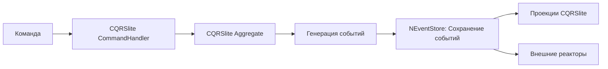

см. https://github.com/Prikalel/OLLAMACHAT/issues/10

### 🧩 Использование CQRSlite поверх NEventStore: архитектурный анализ и практическая реализация  

Сочетание **CQRSlite** (легковесного фреймворка для CQRS/Event Sourcing) и **NEventStore** (популярной .NET-библиотеки для хранения событий) позволяет создавать масштабируемые и отказоустойчивые системы. Рассмотрим ключевые аспекты интеграции, преимущества и ограничения.

---

#### 🧠 1. **Архитектурные роли компонентов**
- **CQRSlite**:
  - Предоставляет базовые абстракции для CQRS/Event Sourcing: `AggregateRoot`, `Command`, `Event`, `Repository` .
  - Упрощает обработку команд, применение событий к агрегатам и управление проекциями.
  - Поддерживает in-memory кэширование агрегатов для ускорения восстановления состояния. Но в нашей задаче это нам не надо.
- **NEventStore**:
  - Реализует журнал событий (Event Store) с поддержкой различных бэкендов (SQL, NoSQL, Redis).
  - Обеспечивает атомарность записи событий и оптимизирован для операций добавления (append-only) .
  - Поддерживает конвейеры обработки событий (pipelines) для валидации или обогащения данных.

---

#### ⚙️ 2. **Схема интеграции**


- **Обработка команд**:
  - `CommandHandler` в CQRSlite вызывает метод агрегата.
  - Агрегат генерирует события (например, `BookBorrowedEvent` ).
- **Сохранение событий**:
  - Репозиторий CQRSlite передает события в NEventStore через метод `Commit`.
  - Пример кода:
    ```csharp
    public async Task SaveAsync(AggregateRoot aggregate)
    {
        var events = aggregate.GetUncommittedChanges();
        using (var stream = _eventStore.OpenStream(aggregate.Id))
        {
            foreach (var e in events)
                stream.Add(new EventMessage { Body = e });
            stream.CommitChanges(Guid.NewGuid());
        }
    }
    ```
- **Восстановление состояния агрегата**:
  - CQRSlite загружает события из NEventStore и применяет их к агрегату через `LoadFromHistory` .

---

#### 🚀 3. **Преимущества комбинации**
- **Гибкость хранилища**:
  - NEventStore поддерживает SQL Server, PostgreSQL, MongoDB, и проч. Нас интересует только sqlite.
- **Производительность**:
  - NEventStore оптимизирован для быстрой записи потоков событий (до 50K событий/сек) .
- **Согласованность данных**:
  - Транзакционность гарантируется на уровне потока событий (stream) в NEventStore.
- **Аудит и отладка**:
  - Журнал событий в NEventStore предоставляет полную историю изменений для анализа .

---

#### ⚠️ 4. **Ограничения и решения**
| **Проблема**                     | **Решение**                                                                 |
|----------------------------------|-----------------------------------------------------------------------------|
| **Миграция схем событий**        | Использование `Upconverters` в NEventStore для преобразования старых версий. |
| **Производительность проекций**  | Асинхронная обработка событий через реакторы CQRSlite .          |
| **Сложность отладки**            | Логирование событий на всех этапах с помощью NLog.                |
| **Рост размера Event Store**     | Архивация старых потоков + снэпшоты агрегатов в CQRSlite .      |

> со снапшотами аггнегатов нужно познакомиться подробнее и узнать что это и с чем едят.

---

#### 💎 Заключение

Интеграция CQRSlite и NEventStore подходит для систем с высокими требованиями к аудиту и масштабируемости (финансы, логистика).

Примеры реализации:  
- [CQRSlite + EventStore](https://github.com/gautema/CQRSlite) (шаблон для старта).  
- [NEventStore + SQL](https://github.com/NEventStore/NEventStore) (демо с конфигурацией).
